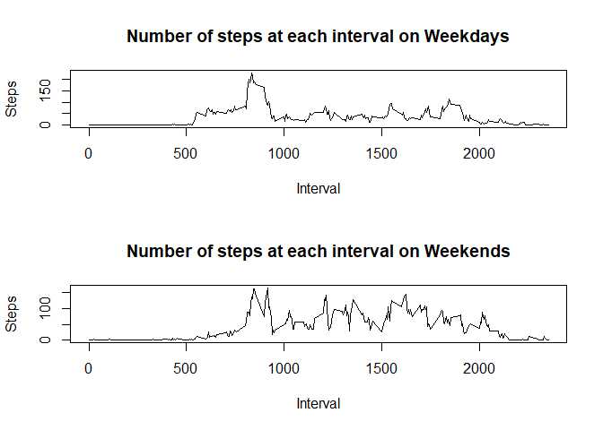

Introduction
============

This is the report for the first peer reviewed assignment in the
Reproducible Research course

Loading and preprocessing the data
----------------------------------

### 1. Load the data (i.e. read.csv() )

This assumes that the working directory is where the file was
uncompressed

    df = read.csv("activity.csv",header=TRUE)

### 2. Process/transform the data (if necessary) into a format suitable for your analysis

There is no further preprocessing needed at this point

What is mean total number of steps taken per day?
-------------------------------------------------

### 1. Calculate the total number of steps taken per day

    daily_df = aggregate(steps ~ date,df,sum )

### 2. Make a histogram of the total number of steps taken each day

    hist(daily_df$steps,main ="Histogram of daily step number frequency", ylab="Frequency",xlab="Steps")

### 3. Calculate and report the mean and median of the total number of steps taken per day

    daily_mean = mean(daily_df$steps)

The daily mean of steps taken is: 1.076618910^{4}

    daily_median = median(daily_df$steps)

The daily median of steps taken is: 10765

What is the average daily activity pattern?
-------------------------------------------

### 1. Make a time series plot of the 5-minute interval (x-axis) and the average number of steps taken, averaged across all days (y-axis)

    interval_df = aggregate(steps ~ interval ,df,mean )
    plot(interval_df$interval,interval_df$steps,main ="Total steps at each interval", ylab="Steps",xlab="Interval",type="l")

\#\#\# 2. Which 5-minute interval, on average across all the days in the
dataset, contains the maximum number of steps?

    max_steps_interval = interval_df$interval[interval_df$steps == max(interval_df$steps)]

The maximum number of steps is found in the interval 835

Inputing missing values
-----------------------

### 1. Calculate and report the total number of missing values in the dataset (i.e. the total number of rows with

NAs)

The number of missing values can be obtained in the following way:

    na_total = sum(is.na(df$steps))

The total number of NAs is: \`na\_total'

### 2. Devise a strategy for filling in all of the missing values in the dataset. The strategy does not need to be sophisticated. For example, you could use the mean/median for that day, or the mean for that 5-minute interval, etc.

In this assignment I propose to replace the missing values with the
corresponding step average for that particular interval truncated to its
floor.

    new_df=df

    for( i in c(1:length(df$steps))) {

           if(is.na(df$steps[i])) {
           
                   new_df$steps[i]=floor(interval_df$steps[interval_df$interval == df$interval[i]])
           }
    }

    new_daily_df = aggregate(steps ~ date,new_df,sum )

### 3. Make a histogram of the total number of steps taken each day with replaced NAs

    hist(new_daily_df$steps,main ="Histogram of daily step number frequency", ylab="Frequency",xlab="Steps")

### 4. Calculate and report the mean and median of the total number of steps taken per day with replaced NAs

    new_daily_mean = mean(new_daily_df$steps)

The daily mean of steps taken is: 1.07497710^{4}

    new_daily_median = median(new_daily_df$steps)

The daily median of steps taken is: 1.064110^{4}

Are there differences in activity patterns between weekdays and weekends?
-------------------------------------------------------------------------

### 1. Create a new factor variable in the dataset with two levels - "weekday" and "weekend" indicating whether a given date is a weekday or weekend day.

    cday = weekdays(as.Date(new_df$date)) 
    weekday = cday

    for( i in c(1:length(cday))){
      
          weekday[i] = cday[i] == "Monday" || cday[i] == "Tuesday" ||
                  cday[i] == "Wednesday" || cday[i] == "Thursday" ||
                  cday[i] == "Friday"
    }

    df_weekday_factor_added = cbind(new_df,weekday)

### 2. Make a panel plot containing a time series plot of the 5-minute interval (x-axis) and the average number of steps taken, averaged across all weekday days or weekend days (y-axis).

First split the df into weekdays and weekends

    df_wd = new_df[df_weekday_factor_added$weekday==TRUE,]
    df_nwd = new_df[df_weekday_factor_added$weekday==FALSE,]

Calculate the average steps at each interval for weekdays and weekends

    interval_wd_df = aggregate(steps ~ interval ,df_wd,mean )
    interval_nwd_df = aggregate(steps ~ interval ,df_nwd,mean )

The plot can be found below:

    par(mfrow=c(2,1))
    plot(interval_nwd_df$interval,interval_wd_df$steps,main ="Number of steps at each interval on Weekdays", ylab="Steps",xlab="Interval", type="l")
    plot(interval_wd_df$interval,interval_nwd_df$steps,main ="Number of steps at each interval on Weekends", ylab="Steps",xlab="Interval", type="l")

